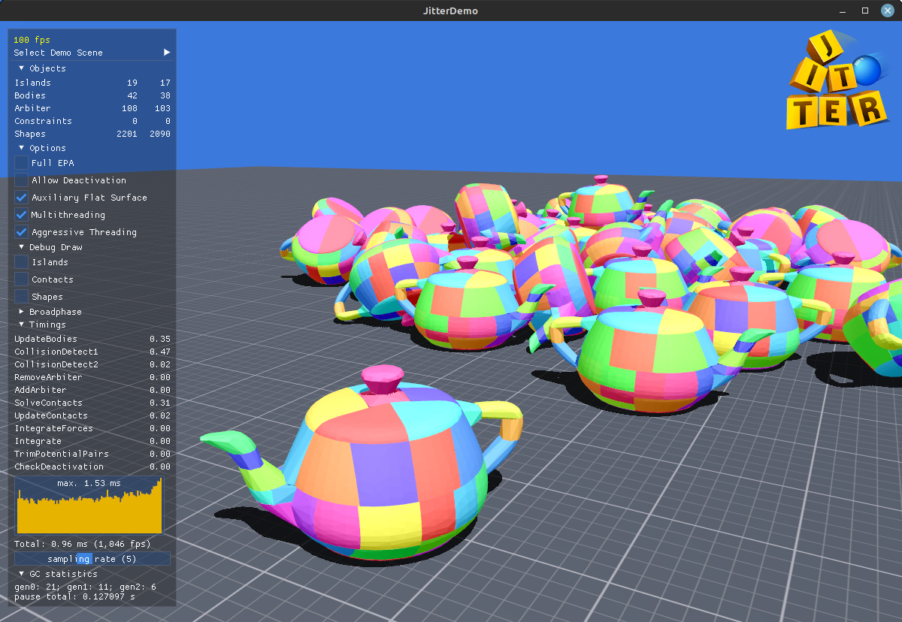
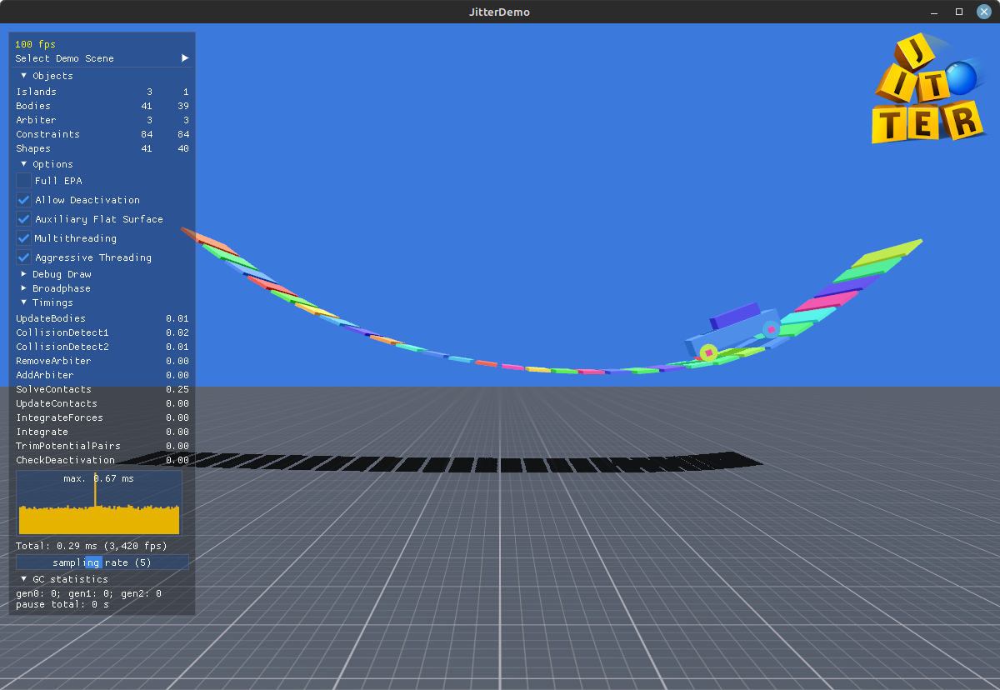
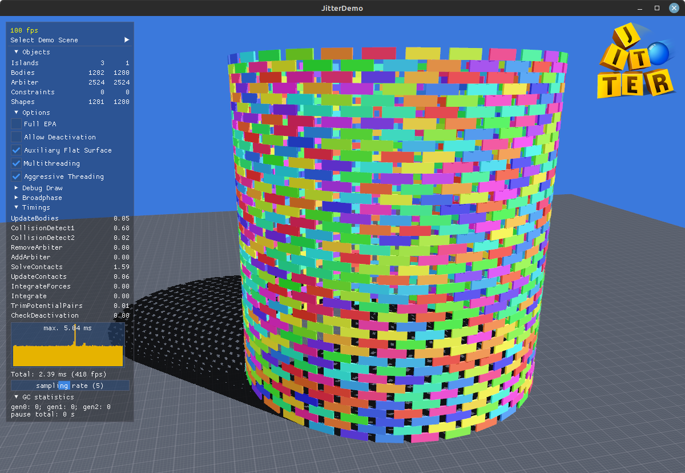
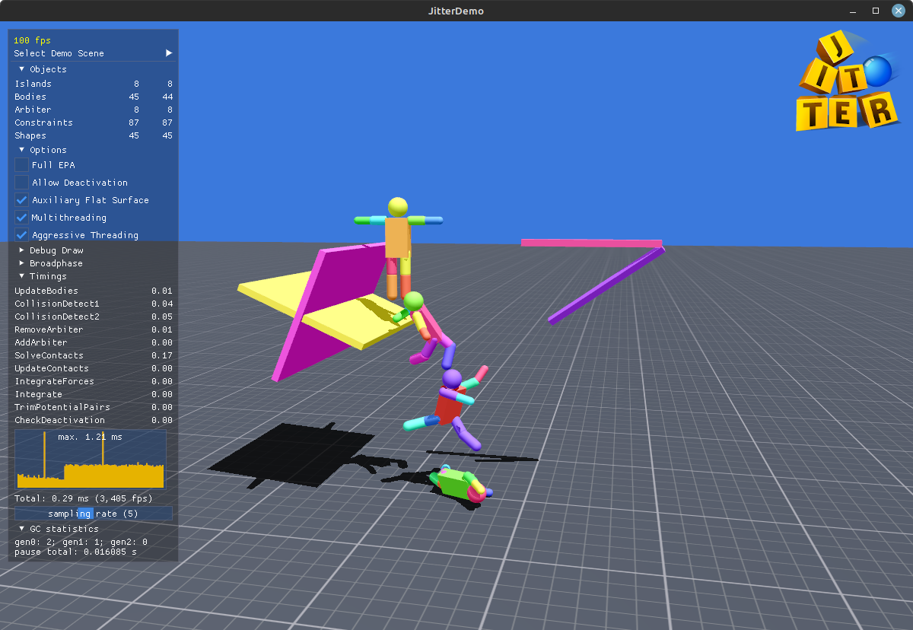

# Jitter2

Jitter2, successor of [Jitter Physics](https://github.com/notgiven688/jitterphysics). Fast, simple, dependency-free, feature-complete physics engine written in C#.

 

 

## Getting started

Jitter2 is cross platform. The src directory contains four
projects:

| Project | Description |
| ----------- | ----------- |
| Jitter2 | The Jitter2 library. |
| JitterDemo | Demo scenes rendered with OpenGL. Tested under Linux and Windows. | 
| JitterBenchmark | Setup for benchmarks utilizing BenchmarkDotNet. | 
| JitterTests | NUnit unit tests. | 

To run the demo scenes:

- Install [.NET 7.0 SDK](https://dotnet.microsoft.com/download/dotnet/7.0)
- git clone https://github.com/notgiven688/jitter2.git
- cd ./Jitter2/src/JitterDemo && dotnet run -c Release

JitterDemo uses [GLFW](https://www.glfw.org/) for accessing OpenGL and window-handling and [cimgui](https://github.com/cimgui/cimgui) for GUI rendering. The project contains these native binaries in precompiled form.

## Features

## Documentation
Most public methods are documented using XML-comments. A docusaurus documentation is beeing worked on at the moment. See ...

## ToDo
- [x] Get Docusaurus up and running
- [ ] Constraints. Check 
