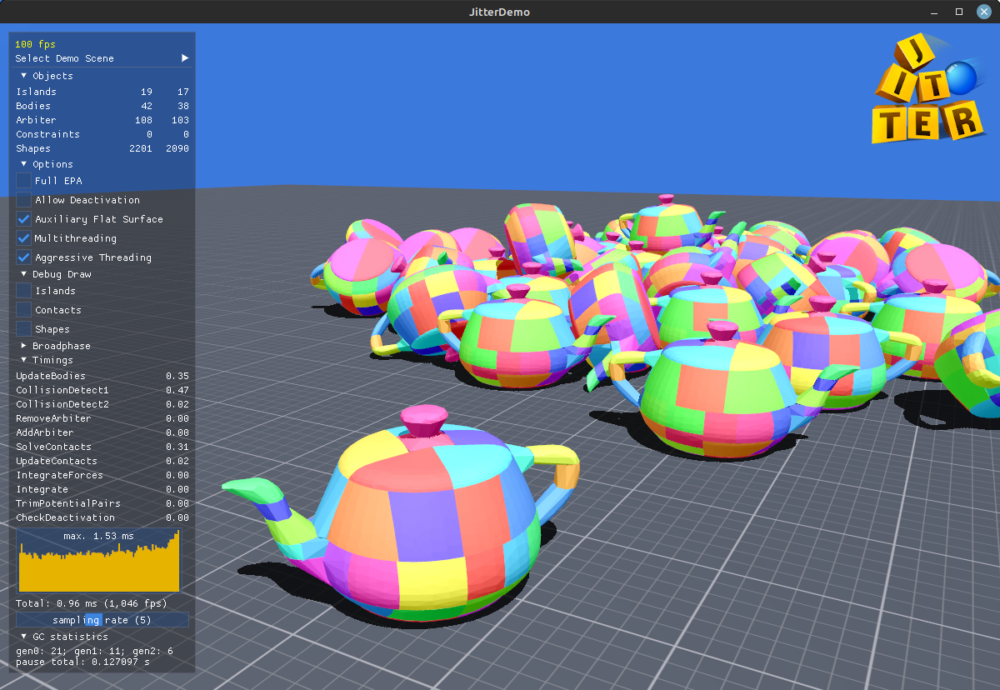
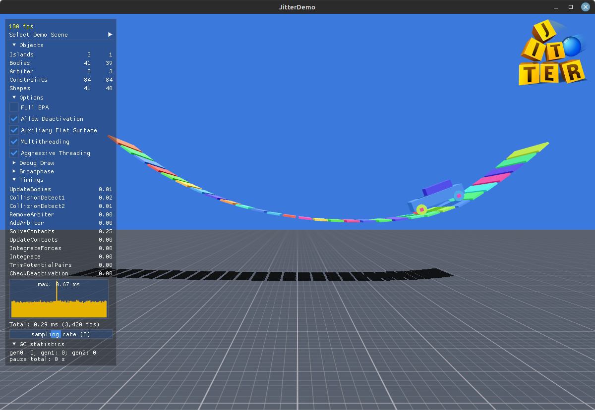
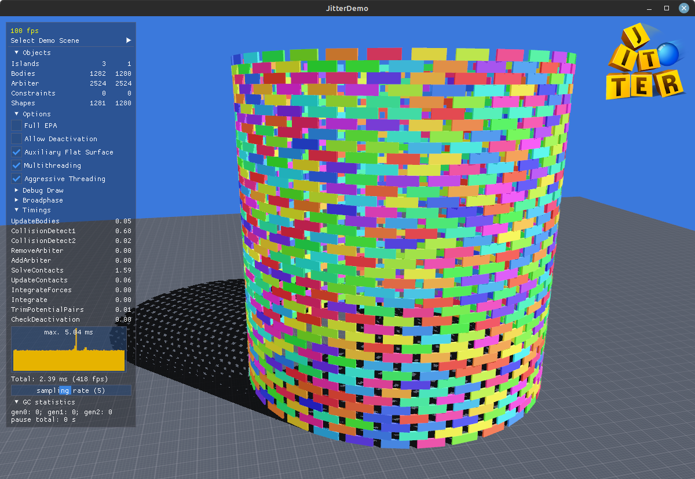
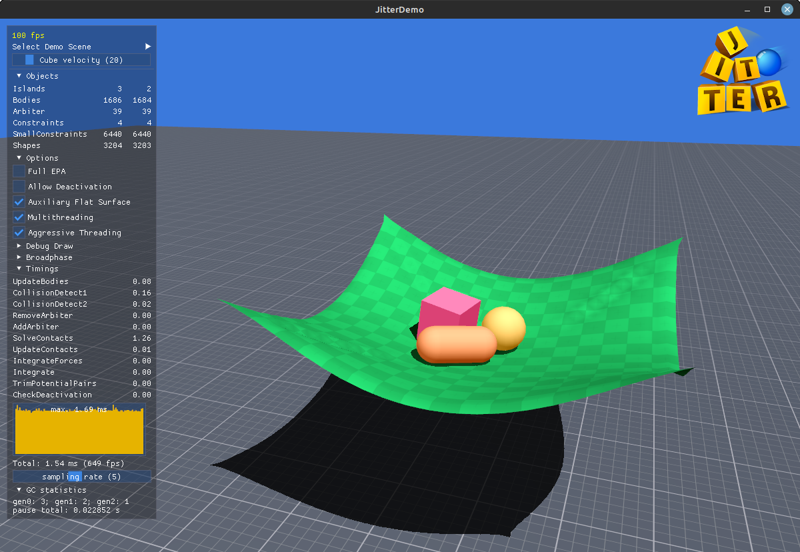

#   Jitter Physics 2

Jitter Physics 2, the evolution of [Jitter Physics](https://github.com/notgiven688/jitterphysics), is an impulse-based dynamics engine with a semi-implicit Euler integrator. It is a fast, simple, and dependency-free engine written in C# with a clear and user-friendly API.

Run a small demo directly [in the browser](https://jitterphysics.com/AppBundle/index.html)!

There is a tiny demo available for the [Godot engine](other/GodotDemo).

The official **NuGet** package can be found [here](https://www.nuget.org/packages/Jitter2).

See below for a fully-featured demo.

---

 

 

## Getting Started

Jitter is cross-platform. The `src` directory contains four projects:

| Project          | Description                                                |
|------------------|------------------------------------------------------------|
| Jitter2          | The main library housing Jitter2's functionalities.         |
| JitterDemo       | Features demo scenes rendered with OpenGL, tested on Linux and Windows. |
| JitterBenchmark  | The setup for conducting benchmarks using BenchmarkDotNet.  |
| JitterTests      | Unit tests utilizing NUnit.

To run the demo scenes:

- Install [.NET 8.0](https://dotnet.microsoft.com/download/dotnet/8.0)
- `git clone https://github.com/notgiven688/jitterphysics2.git`
- `cd ./jitterphysics2/src/JitterDemo && dotnet run -c Release`

JitterDemo uses [GLFW](https://www.glfw.org/) for accessing OpenGL and managing windows, and [cimgui](https://github.com/cimgui/cimgui) for GUI rendering. The project contains these native binaries in a precompiled form. On Linux you may have to install GLFW, e.g. on Ubuntu `sudo apt-get install libglfw3-dev`.

## Features

- [x] Speculative contacts (avoiding the bullet-through-paper problem).
- [x] A variety of constraints and motors (AngularMotor, BallSocket, ConeLimit, DistanceLimit, FixedAngle, HingeAngle, LinearMotor, PointOnLine, PointOnPlane, TwistAngle) with support for softness.
- [x] A sophisticated deactivation scheme with minimal cost for inactive rigid bodies (scenes with 100k inactive bodies are easily achievable).
- [x] Edge collision filter for internal edges of triangle meshes.
- [x] Substepping for improved constraint and contact stability.
- [x] Generic convex-convex collision detection using EPA-aided MPR.
- [x] "One-shot" contact manifolds using auxiliary contacts for flat surface collisions.
- [x] Efficient compound shapes.
- [x] Easy integration of custom shapes. Integrated: Box, Capsule, Cone, Convex Hull, Point Cloud, Sphere, Triangle, Transformed.
- [x] Soft-body dynamics!

## Documentation

Find the [documentation here](https://notgiven688.github.io/jitterphysics2).

## ToDo

- [x] Develop and distribute NuGet packages and releases.
- [x] Stabilize the engine and demo.
- [ ] Expand the documentation to cover more topics and functionalities.

## Contribute 👋

Contributions of all forms are welcome! Feel free to fork the project and create a pull request.
