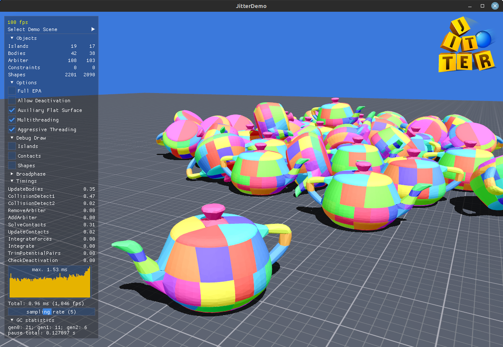
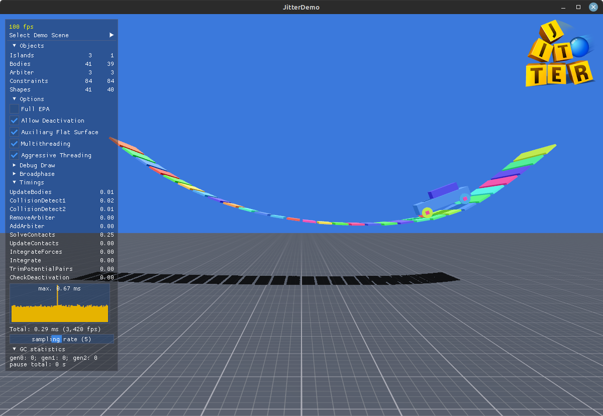
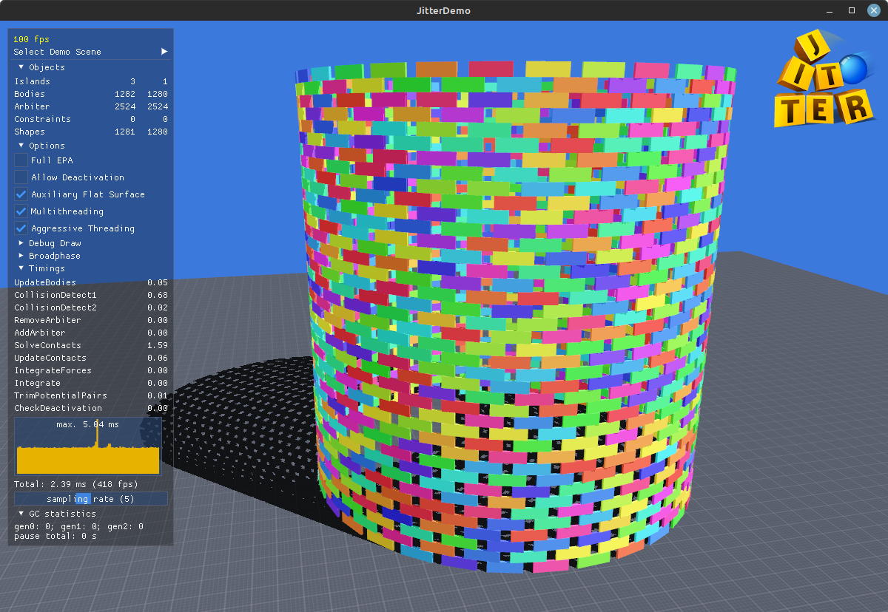
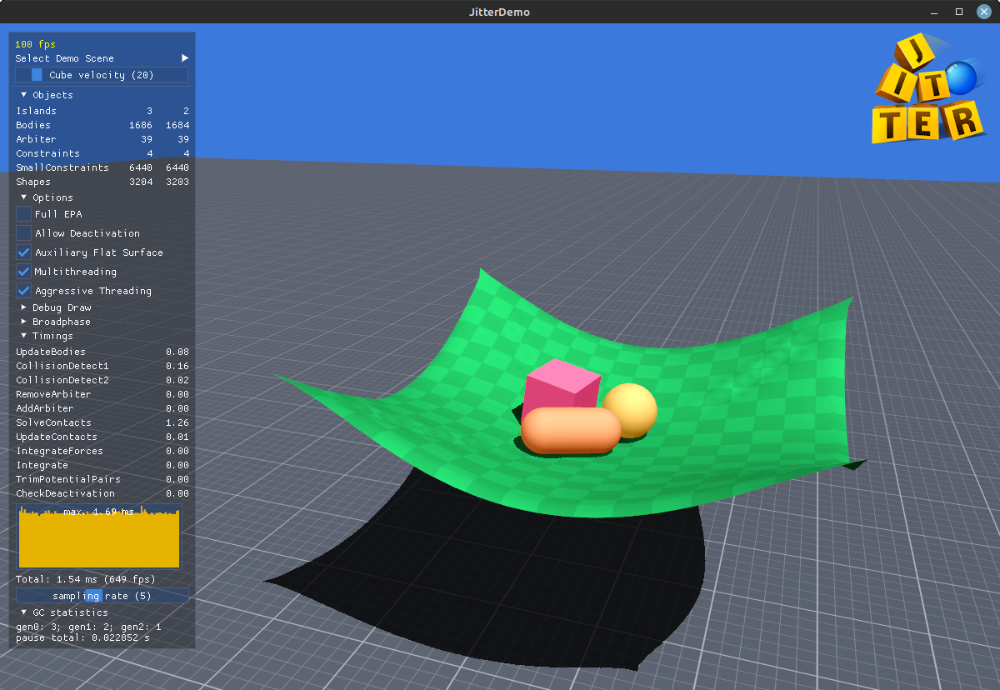

#   Jitter Physics 2

[](https://github.com/notgiven688/jitterphysics2/actions/workflows/jitter-tests.yml)
[](https://www.nuget.org/packages/Jitter2/)
[](https://discord.gg/7jr3f4edmV)

Jitter Physics 2 is a fast, dependency-free physics engine written in C#, with rigid-body and soft-body dynamics. It runs across platforms supported by .NET and is the successor to [Jitter Physics](https://github.com/notgiven688/jitterphysics).

📦 Install [Jitter2](https://www.nuget.org/packages/Jitter2) from NuGet, or [Jitter2.Double](https://www.nuget.org/packages/Jitter2.Double) for double precision. See the [changelog](https://jitterphysics.com/docs/changelog).

▶️ Try the interactive demo and explore the docs at **[jitterphysics.com](https://jitterphysics.com/docs/introduction.html)**.

---

 

 

## Getting Started

Add Jitter to your .NET project:

```sh
dotnet add package Jitter2
```

Create a world, add a box, and simulate one second with a fixed time step:

```csharp
using System;
using Jitter2;
using Jitter2.Collision.Shapes;
using Jitter2.LinearMath;

using var world = new World();
world.Gravity = new JVector(0, -9.81f, 0);

var box = world.CreateRigidBody();
box.AddShape(new BoxShape(1, 1, 1));
box.Position = new JVector(0, 5, 0);

for (int i = 0; i < 60; i++)
{
    world.Step(1.0f / 60.0f);
}

Console.WriteLine(box.Position);
```

For a complete example with rendering, follow the [falling boxes tutorial](https://jitterphysics.com/docs/tutorials/boxes/project-setup.html).

## Running the Demos

The `src` directory contains four projects:

| Project          | Description                                                |
|------------------|------------------------------------------------------------|
| Jitter2          | Physics library.                                           |
| JitterDemo       | Interactive OpenGL demos.                                  |
| JitterBenchmark  | BenchmarkDotNet benchmarks.                                |
| JitterTests      | NUnit tests.                                               |

To run the demo scenes:

Install the [.NET 10 SDK](https://dotnet.microsoft.com/download/dotnet/10.0), then run:

```sh
git clone https://github.com/notgiven688/jitterphysics2.git
cd jitterphysics2/src/JitterDemo
dotnet run -c Release
```

JitterDemo uses [GLFW](https://www.glfw.org/) for accessing OpenGL and managing windows, and [VellumUI](https://www.nuget.org/packages/VellumUI/) for the demo UI overlay. The project contains the GLFW native binaries in precompiled form.

## Features

- Rigid-body and soft-body dynamics.
- Single or double precision, selected at compile time.
- Optional cross-platform deterministic solver for reproducible simulations.
- Impulse-based solver with a semi-implicit Euler integrator and substepping.
- Speculative contacts to reduce tunneling.
- Constraints and motors with configurable softness.
- Deactivation to reduce the cost of inactive rigid bodies.
- Triangle meshes with filtering of internal edges.
- Convex collision detection using EPA-aided MPR and one-shot contact manifolds.
- Compound shapes and custom support mappings, alongside built-in boxes, spheres, capsules, cylinders, cones, convex hulls, point clouds, and triangles.

## Documentation

Explore the [documentation and interactive demo](https://jitterphysics.com/docs/introduction.html) for tutorials, API details, and examples.

## Credits

Grateful acknowledgment to Erin Catto, Dirk Gregorius, Erwin Coumans, Gino van den Bergen, Daniel Chappuis, Marijn Tamis, Danny Chapman, Gary Snethen, and Christer Ericson for sharing their knowledge through forum posts, talks, code, papers, and books.

Special thanks also to the contributors of the predecessor projects JigLibX and Jitter.

## Contribute 👋

Contributions of all forms are welcome! Feel free to fork the project and create a pull request.
