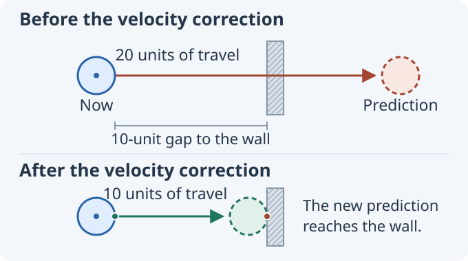
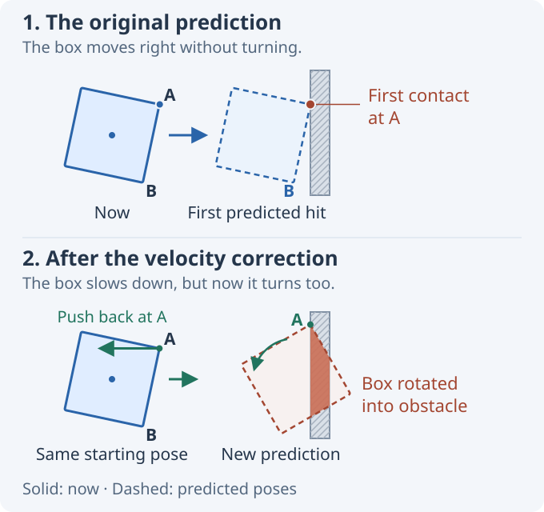
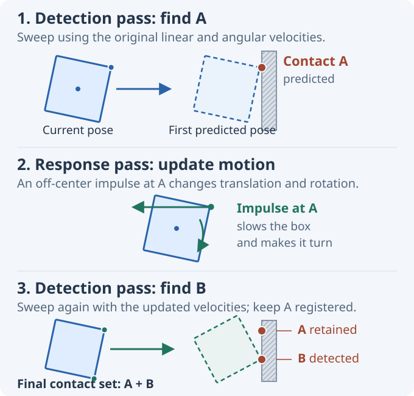

# Iterative Speculative Contact Discovery (ISCD)

Speculative contacts prevent tunneling by creating a contact before two shapes actually touch. This works well until the contact impulse changes the motion in a way that the original collision query did not examine. An off-center impulse, for example, can make a body rotate into another collision during the same timestep.

The method explored here repeats collision detection after such an impulse. This article uses the name **Iterative Speculative Contact Discovery (ISCD)** for that approach: detect a speculative contact, apply its impulse, then detect again using the updated velocities.

The discussion assumes a standard impulse-based rigid-body solver. JitterDemo includes an experimental implementation in [CcdSolver.cs](https://github.com/notgiven688/jitterphysics2/blob/main/src/JitterDemo/Demos/Misc/CcdSolver.cs), and an interactive example appears below.

## A contact before contact

Consider a ball whose surface is 10 units away from a thin wall. During the next timestep, its velocity would carry it 20 units. The ball starts on one side of the wall and ends on the other, so discrete overlap tests at the start and end of the step find nothing. The ball tunnels through the wall.

Continuous collision detection (CCD) finds the crossing by **sweeping** the ball along its predicted path. The sweep reports where the surfaces would first touch. It does not move the ball and it does not change its velocity; it only detects the future collision.

A **speculative contact** turns that prediction into a constraint for the impulse solver. Unlike a regular contact, its two contact points are still separated. The constraint allows the ball to close the 10-unit gap during this timestep, but not to travel through the wall. The solver applies an impulse that removes the excess closing velocity.

<figure class="ccd-figure">
  
  <figcaption>Both rows start at the same position. The dashed circle shows the predicted position at the end of the step. After the speculative impulse, the prediction ends at the wall instead of passing through it. Bounce is omitted.</figcaption>
</figure>

The two markers in the figure are the contact points, one on each shape. They are stored at the current poses of the bodies, which is why there is still a gap between them. Together with the contact normal, they give the solver the separation $d$. For a timestep $\Delta t$, the contact may close at no more than $d / \Delta t$. Any faster approach would make the separation negative before the step ends.

That is the essential difference from an ordinary contact: an ordinary contact assumes the shapes are already touching or overlapping, while a speculative contact constrains them while they are still separated. For background on speculative contacts and other approaches to tunneling, see [Erin Catto's 2013 talk, *Continuous Collision*](https://box2d.org/files/ErinCatto_ContinuousCollision_GDC2013.pdf).

## The response changes the prediction

Now replace the ball with a slightly tilted box. The box moves straight toward the wall and has no angular velocity. Corner A is closest, so the sweep finds a collision there and creates a speculative contact.

The solver applies an impulse at A. Because A is offset from the center of mass, the impulse changes both the linear and angular velocity of the box. It slows A's approach, but it also starts rotating corner B toward the wall.

The velocity of any point on a rigid body is

$$
v_p = v + \omega \times r,
$$

where $v$ is its linear velocity, $\omega$ its angular velocity, and $r$ points from the center of mass to the point. The impulse at A changes both $v$ and $\omega$, so it also changes the velocity at B.

The new motion is shown below. A now reaches the wall as intended, but B rotates into it. The first sweep could not find this second collision because the box was not rotating until the solver responded at A.

<figure class="ccd-figure">
  
  <figcaption>The solid box is the starting pose in both rows. The lower dashed box is the end-of-step prediction after the impulse at A. The overlap at B is highlighted in red, but no contact has been created there yet.</figcaption>
</figure>

More solver iterations at A cannot fix this. The solver only knows about the contact at A; it cannot create the missing contact at B. Collision detection has to run again.

A simple workaround is to freeze the angular response of speculative contacts and change only linear velocity. That avoids the new collision in this example, but it also removes the physically expected rotation from an off-center impact.

## Respond, then detect again

ISCD keeps the angular response and repeats collision detection with the velocities produced by the solver.

During this discovery process, the bodies are not advanced. Their positions and orientations remain at the start of the timestep; only their linear and angular velocities change. Every sweep predicts the same upcoming timestep from the same starting poses.

For the box, the sequence is:

1. Sweep using the original velocities and create the speculative contact at A.
2. Apply a solver iteration at A. The resulting impulse changes the box's linear and angular velocity.
3. Sweep again from the original pose, now using the updated velocities. This sweep finds B and adds a second contact.

In short:

> **detect A → solve {A} → detect B → solve {A, B} → solve {A, B} again…**

Each solver pass includes every contact discovered so far. The contact at A therefore remains active when B is added, and the response at B can correct the impulse at A. Because that response may change the predicted motion again, discovery continues for a fixed number of passes.

<figure class="ccd-figure">
  
  <figcaption>Detect A, respond at A, then detect B. In the final panel, both contacts are known. The dashed box is the prediction that revealed B, not the final pose after both contacts have been solved.</figcaption>
</figure>

The sweep's time of impact is used to select the next predicted contact. It does not create a substep and the simulation is not advanced to that time. After each response, the next sweep starts from the original poses and covers the full timestep again.

### Solving the contacts together

The impulses applied during discovery are used to expose further contacts. Once discovery ends, the normal world solver resolves all collected contacts together with the other contacts and joints in the world.

At this point A and B are coupled. An impulse at B changes the velocity at A, and a later solver iteration can update the impulse at A in response. The bodies are integrated only after this solve is complete.

## Interactive example

The newly discovered contact does not have to involve the same pair of shapes. In this demo, a fast sphere approaches the upper half of a thin panel from the left. The panel is pinned at its center of mass, so it can rotate but cannot translate. A second sphere rests close to its lower half.

The demo uses a standard impulse solver with a fixed $1/30$-second step. Compare the three methods:

- **1. Standard Solver:** the incoming sphere tunnels through the panel because the sampled poses never overlap.
- **2. Speculative Contacts:** the sweep finds the first contact and prevents the sphere from passing through the panel. Its impulse rotates the panel into the lower sphere, but that new collision is never detected.
- **3. ISCD - four passes:** after responding to the first contact, another sweep finds the contact between the panel and the lower sphere. The main solver then resolves both contacts during the same timestep.

Use **Pause** and **Step 1/30 s** to inspect individual timesteps. The dashed outlines show the end-of-step poses predicted from the current velocities.

<iframe class="ccd-demo" src="iscd-demo.html" width="760" height="610" loading="lazy" title="Interactive demonstration of iterative speculative contact discovery"></iframe>

## What still needs care

Every additional pass costs another set of sweeps. In practice, ISCD can be enabled only for bodies that are expected to move fast enough to need it. Discovery must also follow bodies whose velocities change through contact. The panel in the demo begins at rest, for example, but has to be swept after the first sphere makes it rotate.

ISCD is iterative and approximate. Its result can depend on discovery order, pass count, solver convergence, sweep accuracy, and whether the contact geometry is refreshed. The final world solve can change the velocities again, so a fixed discovery budget cannot guarantee that every required contact has been found.

*Disclosure: This article was written with the help of AI. The ISCD idea itself came from the author, not the AI; no claim is made that similar methods have not appeared elsewhere.*

