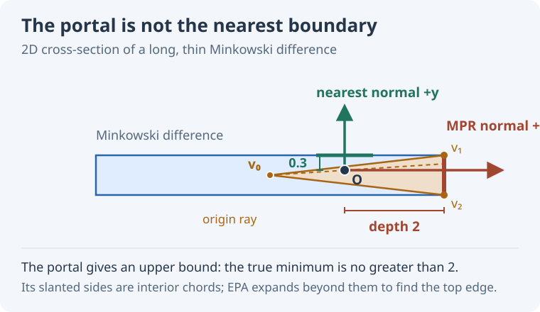

# MPR and EPA for Penetration Depth

A physics engine usually asks for contact information when two shapes are just touching or overlap by a small amount. Occasionally, however, it receives a pair that overlaps deeply: a body may have been teleported, a large timestep may have missed the first contact, or a stack may have compressed. The same collision query has to handle both cases.

Minkowski Portal Refinement (MPR) and the Expanding Polytope Algorithm (EPA) fit together particularly well here. MPR finds a contact through a small, stable local search. EPA can check whether that contact is the *least* penetration and continue searching when it is not. The trick is to run EPA only when MPR's reported depth gives us reason to doubt the local answer.

This article assumes familiarity with Minkowski differences and support maps. Gary Snethen introduced MPR in [XenoCollide](https://github.com/notgiven688/xenocollide).

## Follow a portal to the surface

Let $M=A-B$ be the Minkowski difference. Overlapping shapes put the origin inside $M$. The penetration depth is the shortest distance from the origin to its boundary; the direction to that nearest boundary gives a separating normal.

MPR starts with a point $v_0$ in the interior of $M$ and keeps it fixed. It obtains three more points on the boundary from support queries. Together, the four points form a tetrahedron. Its outer triangular face is the **portal**: the origin lies in the wedge from $v_0$ through that face. MPR repeatedly asks the support map for a point beyond the portal, then replaces one portal vertex. In effect, it scans the part of the surface visible along that wedge without constructing a full boundary mesh.

The resulting portal supplies a normal, a penetration estimate, and contact points. MPR turns out to be very robust.

The especially useful case is first contact. For a fixed pair of shapes approaching an isolated contact, the ray from the interior point through the origin reaches the nearby surface patch. Close enough to first touch, that local patch also gives the global minimum penetration. MPR can therefore return the contact geometry the solver needs without building a polytope. “Close enough” depends on the geometry; it is not a universal distance in world units.

## Where a local answer goes wrong

Deep inside a long, thin Minkowski difference, the portal can settle on the wrong side. The figure shows a two-dimensional section, where the tetrahedron becomes a triangle. The origin lies inside the triangle made from an interior point $v_0$ and the two vertices on the right. Its right edge is a valid portal, with a normal pointing right. But the *top boundary of the Minkowski difference* is much closer to the origin.

<figure class="mpr-figure">
  
  <figcaption>The right edge is the portal selected by this local search. The top edge of the Minkowski difference is the global answer. The slanted sides of the triangle are interior chords, not candidate collision boundaries.</figcaption>
</figure>

In this example, the MPR direction gives depth $2$, while the minimum depth is $0.3$. MPR found a way out, just not the shortest way out. Notice that the reported depth is an **upper bound** on the true minimum. If $h_M(n)$ is the support plane distance of $M$ in unit direction $n$, then

$$
d_* = \min_{\lVert n\rVert=1} h_M(n)
\quad\text{and}\quad
d_* \le d_{\mathrm{MPR}} = h_M(n_{\mathrm{MPR}}).
$$

This asymmetry makes a simple handoff possible. If MPR reports a depth below a chosen tolerance, the true depth is no larger than that tolerance either. A larger reported depth leaves open the possibility that another direction is much shallower, as in the figure. The tolerance controls how much depth error we are willing to accept from the local answer. It does **not** certify that the MPR normal is globally correct: scaling the entire thin-bar example down can make its wrong rightward answer arbitrarily small.

## Give the portal to EPA

EPA takes a convex polytope containing the origin and expands its closest face using support queries. When no support point significantly extends that face, it has found the nearest boundary within its numerical tolerance. In the thin-bar example, it does not have to accept the right portal: it can expand the triangle past its interior chords until the top boundary becomes the closest edge.

The awkward part is often obtaining a suitable starting polytope. GJK is excellent at distance queries for separated shapes and can also detect overlap. But once the origin is inside the Minkowski difference, its distance result is zero; it does not by itself give the penetration normal and depth. Near touching, a GJK simplex used to start EPA may be lower-dimensional or nearly degenerate. Implementations need extra work to create a useful enclosing tetrahedron. [Van den Bergen's original EPA description](https://graphics.stanford.edu/courses/cs468-01-fall/Papers/van-den-bergen.pdf) discusses these lower-dimensional cases. Spherical expansion followed by reduction is another way to make a near-touching query easier, but it adds geometry and bookkeeping. EPA is easier to initialize when the origin is comfortably enclosed, which is more likely with deeper overlap.

MPR has already done the setup work. Its fixed interior point and three portal vertices form a tetrahedron containing the origin. If the MPR depth exceeds the chosen threshold, those four vertices can be passed straight to EPA. EPA then examines the closest face of that tetrahedron. If the existing portal was already the global answer, its support test can confirm that quickly. Otherwise, EPA grows the hull toward a closer boundary. The cost of that broader search is paid only for contacts beyond the threshold.

## Interactive example

Drag the circle across the fixed bar. Green shows the penetration normal when MPR finds a minimum-depth exit. When it finds a longer way out, its normal turns red and EPA's result appears in green. The readout gives both depths and normals; the arrows have a fixed length so their directions remain visible. Use **Near contact** and **Wrong portal** to jump between the two cases.

The lower view shows the Minkowski sum of the bar and a disk, shifted opposite the sphere's motion. The origin stays fixed while the shape moves. MPR's final triangle is drawn inside it, with the portal edge highlighted in green or red. The green line reaches EPA's nearest boundary point. When the results differ, a red dashed line shows MPR's depth to its support plane; the small tick at its end is not necessarily on the boundary.

The demo runs EPA at every overlapping position so that the answers can be compared. The cutoff described above would skip EPA for sufficiently small MPR depths.

<iframe class="mpr-demo" src="mpr-epa-demo.html" width="760" height="900" loading="lazy" title="Interactive MPR and EPA comparison for a draggable circle, fixed bar, and Minkowski sum"></iframe>

The combination follows the needs of a physics engine: use MPR's local contact where shallow overlap makes that answer most useful, and let EPA search globally when the local estimate says there is room for a substantially shorter escape.

For a concrete implementation of this MPR–EPA handoff, see [NarrowPhase.cs](https://github.com/notgiven688/jitterphysics2/blob/main/src/Jitter2/Collision/NarrowPhase/NarrowPhase.cs).

*Disclosure: AI helped write this article. The observations and the idea of using a depth threshold to hand MPR's portal to EPA came from the author.*

