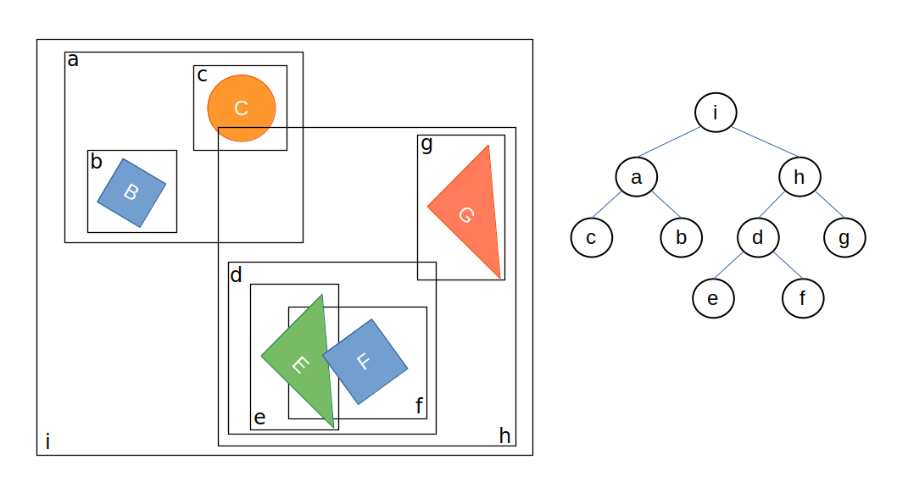

# Dynamic Tree

The dynamic tree holds instances which implement the `IDynamicTreeProxy` interface.
Its main task is to efficiently determine if a proxy's axis-aligned bounding box overlaps with the axis-aligned bounding box of any other proxy in the world.
A naive implementation requires $\mathcal{O}\left(n\right)$ operations (checking for an overlap with every of the $n-1$ entities).
The tree structure accelerates this to $\mathcal{O}\left(\mathrm{log}(n)\right)$.
Since proxies are dynamic and can move, the tree must be continuously updated.
To trigger updates less frequently, entities are enclosed within slightly larger bounding boxes than their actual size.
This bounding box extension is defined by the `Velocity` property of the `IDynamicTreeProxy` interface.



## Adding proxies

All shapes added to a rigid body (`body.AddShape`) are automatically registered with `world.DynamicTree`.
Custom implementations of `IDynamicTreeProxy` can be added to the tree using `tree.AddProxy`.
In this case, a `BroadPhaseFilter` must be implemented and registered (using `world.BroadPhaseFilter`) to handle collisions with the custom proxy, otherwise an `InvalidCollisionTypeException` is thrown.

## Enumerate Overlaps

The tree implementation needs to be updated using `tree.Update`.
This is done automatically for the dynamic tree owned by the world class (`world.DynamicTree`).
Internally, `UpdateWorldBoundingBox` is called for active proxies implementing the `IUpdatableBoundingBox` interface, and the internal book-keeping of overlapping pairs is updated.
Overlaps can be queried using `tree.EnumerateOverlaps`.

## Querying the tree

The dynamic tree is a broadphase structure.
Its job is to quickly reduce the set of possible candidates.
Some APIs stop there and return proxies, while others continue with an exact narrowphase test.

In practice there are two layers of queries:

- Broadphase-only queries, such as `Query(...)`, which return candidate proxies.
- Broadphase + narrowphase queries, such as `RayCast(...)`, `SweepCast(...)`, and `FindNearest(...)`, which continue with exact tests on supported proxies.

Overlap detection is also covered by the `FindNearest` query described below.

### Broadphase-only queries

All tree proxies that overlap a given axis-aligned box can be queried:

```cs
public void Query<T>(T hits, in JBoundingBox box) where T : class, ICollection<IDynamicTreeProxy>
public void Query<TSink>(ref TSink hits, in JBoundingBox box) where TSink : ISink<IDynamicTreeProxy>
```

As well as all proxies which overlap with a ray:

```cs
public void Query<T>(T hits, in JVector rayOrigin, in JVector rayDirection) where T : class, ICollection<IDynamicTreeProxy>
public void Query<TSink>(ref TSink hits, in JVector rayOrigin, in JVector rayDirection) where TSink : ISink<IDynamicTreeProxy>
```

Custom broadphase queries can easily be implemented.
An implementation which queries all proxies overlapping with a single point:

```cs
var stack = new Stack<int>();
stack.Push(tree.Root);

ReadOnlySpan<DynamicTree.Node> nodes = tree.Nodes;

while (stack.TryPop(out int id))
{
    ref readonly DynamicTree.Node node = ref nodes[id];
    
    if (node.ExpandedBox.Contains(point))
    {
        if (node.IsLeaf)
        {
            Console.WriteLine($'{node.Proxy} contains {point}.');
        }
        else
        {
            stack.Push(node.Left);
            stack.Push(node.Right);
        }
    }
}
```

### Exact query helpers

The tree also provides helpers that combine broadphase pruning with an exact narrowphase test.
These return the closest exact hit instead of raw candidate proxies.

#### Ray casting

All proxies in the tree which implement the `IRayCastable` interface can be raycasted, including all shapes:

```cs
public bool RayCast(JVector origin, JVector direction, RayCastFilterPre? pre, RayCastFilterPost? post,
    out IDynamicTreeProxy? proxy, out JVector normal, out Real lambda)
```

The pre- and post-filters can be used to discard hits during the ray cast.
A ray is shot from the origin into the specified direction.
The function returns `true` if a hit was found.
The point of collision is given by `hit = origin + lambda * direction`, where `lambda` is in the range `[0, ∞)`.

The returned `normal` is the normalized surface normal at the hit point.

#### Sweep casting

All proxies in the tree which implement the `ISweepTestable` interface can be sweep-tested, including all shapes:

```cs
// Unbounded: considers lambda in [0, ∞)
public bool SweepCast<T>(in T support, in JQuaternion orientation, in JVector position, in JVector direction,
    SweepCastFilterPre? pre, SweepCastFilterPost? post,
    out IDynamicTreeProxy? proxy, out JVector pointA, out JVector pointB, out JVector normal, out Real lambda)
    where T : ISupportMappable

// Bounded: only considers hits with lambda ≤ maxLambda
public bool SweepCast<T>(in T support, in JQuaternion orientation, in JVector position, in JVector direction, Real maxLambda,
    SweepCastFilterPre? pre, SweepCastFilterPost? post,
    out IDynamicTreeProxy? proxy, out JVector pointA, out JVector pointB, out JVector normal, out Real lambda)
    where T : ISupportMappable
```

The query shape is defined by an `ISupportMappable` plus its world-space `orientation` and `position`.
`direction` is the sweep direction vector; `lambda` is expressed in units of `direction`, so the query shape's center at impact is at `position + lambda * direction`.

`pointA` and `pointB` are contact points expressed in the starting configuration of each body (at `t = 0`, before any motion).
Because `SweepCast` targets are always stationary, `pointB` is simply the world-space contact point.
The world-space contact point on the query shape is `pointA + lambda * direction`.
`normal` is the collision normal in world space, pointing from the target toward the query shape.

The **pre-filter** (`SweepCastFilterPre`) is called before the exact narrowphase test and receives only the candidate proxy.
Use it to cheaply skip proxies by identity (e.g. ignore the body being swept).
The **post-filter** (`SweepCastFilterPost`) is called after the exact test and receives the full `SweepCastResult` (including `Lambda`, `Normal`, `PointA`, `PointB`).
Use it to reject hits based on geometry, or to collect multiple results rather than stopping at the first.
Returning `false` from either filter skips that candidate without terminating the sweep.

For common built-in query shapes, convenience overloads are available:

```cs
public bool SweepCastSphere(Real radius, in JVector position, in JVector direction, ...)
public bool SweepCastBox(in JVector halfExtents, in JQuaternion orientation, in JVector position, in JVector direction, ...)
public bool SweepCastCapsule(Real radius, Real halfLength, in JQuaternion orientation, in JVector position, in JVector direction, ...)
public bool SweepCastCylinder(Real radius, Real halfHeight, in JQuaternion orientation, in JVector position, in JVector direction, ...)
```

Each has a bounded variant with a `maxLambda` parameter.

#### Find nearest query

All proxies in the tree which implement the `IDistanceTestable` interface can be distance-queried, including all shapes:

```cs
// Unbounded: considers all proxies
public bool FindNearest<T>(in T support, in JQuaternion orientation, in JVector position,
    FindNearestFilterPre? pre, FindNearestFilterPost? post,
    out IDynamicTreeProxy? proxy, out JVector pointA, out JVector pointB, out JVector normal, out Real distance)
    where T : ISupportMappable

// Bounded: only considers proxies closer than maxDistance
public bool FindNearest<T>(in T support, in JQuaternion orientation, in JVector position, Real maxDistance,
    FindNearestFilterPre? pre, FindNearestFilterPost? post,
    out IDynamicTreeProxy? proxy, out JVector pointA, out JVector pointB, out JVector normal, out Real distance)
    where T : ISupportMappable
```

The query shape is defined by an `ISupportMappable` plus its world-space `orientation` and `position`.

The **pre-filter** (`FindNearestFilterPre`) is called before the exact narrowphase test and receives only the candidate proxy.
The **post-filter** (`FindNearestFilterPost`) is called after the exact test and receives the full `FindNearestResult`.
For overlap results the post-filter receives `distance = 0` and `normal = Zero`.
Returning `false` from either filter skips that candidate and continues the search.

To skip overlapping proxies and find the nearest *separated* proxy instead, reject overlap results in the post-filter:

```cs
world.DynamicTree.FindNearestSphere(radius, position,
    pre: null,
    post: result => result.Distance > 0,
    out proxy, out pointA, out pointB, out normal, out distance);
```

For common built-in query shapes, convenience overloads are available:

```cs
public bool FindNearestPoint(in JVector position, ...)
public bool FindNearestSphere(Real radius, in JVector position, ...)
```

Each has a bounded variant with a `maxDistance` parameter.

### Overlap check example

Overlap checks can be composed by querying the tree with a bounding box first and then running an exact narrowphase overlap test against the returned candidates:

```cs
var sphere = ConvexPrimitives.CreateSphere(radius);
ShapeHelper.CalculateBoundingBox(sphere, JQuaternion.Identity, center, out JBoundingBox box);

List<IDynamicTreeProxy> candidates = [];
tree.Query(candidates, box);

bool overlap = false;

foreach (var candidate in candidates)
{
    if (candidate is not RigidBodyShape shape) continue;

    if (NarrowPhase.Overlap(sphere, shape,
        JQuaternion.Identity, shape.RigidBody.Orientation,
        center, shape.RigidBody.Position))
    {
        overlap = true;
        break;
    }
}
```

This pattern is usually enough for overlap checks and avoids introducing additional broadphase API surface.
