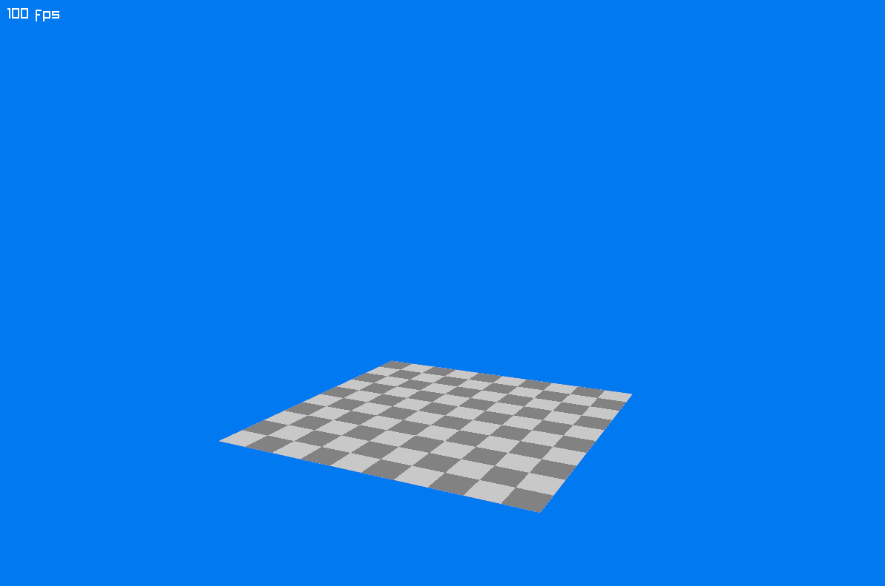

# Setting Up a Render Loop

The first thing we need to do is to familiarize ourselves a bit with Raylib_cs. Replace the content of `Program.cs` with the following code:

```cs Program.cs showLineNumbers
using System.Numerics;
using Raylib_cs;
using static Raylib_cs.Raylib;

static Texture2D GenCheckedTexture(int size, int checks, Color colorA, Color colorB)
{
    Image imageMag = GenImageChecked(size, size, checks, checks, colorA, colorB);
    Texture2D textureMag = LoadTextureFromImage(imageMag);
    UnloadImage(imageMag);
    return textureMag;
}

// set a hint for anti-aliasing
SetConfigFlags(ConfigFlags.Msaa4xHint);

// initialize a 1200x800 px window with a title
InitWindow(1200, 800, "BoxDrop example");

// dynamically create a plane model
Texture2D texture = GenCheckedTexture(10, 1,  Color.LightGray, Color.Gray);
Model planeModel = LoadModelFromMesh(GenMeshPlane(10, 10, 10, 10));
SetMaterialTexture(ref planeModel, 0, MaterialMapIndex.Diffuse, ref texture);

// create a camera
Camera3D camera = new ()
{
    Position = new Vector3(-20.0f, 8.0f, 10.0f),
    Target = new Vector3(0.0f, 4.0f, 0.0f),
    Up = new Vector3(0.0f, 1.0f, 0.0f),
    FovY = 45.0f,
    Projection = CameraProjection.Perspective
};

// 100 fps target
SetTargetFPS(100);

// simple render loop
while (!WindowShouldClose())
{
    BeginDrawing();
    ClearBackground(Color.Blue);

    BeginMode3D(camera);

    DrawModel(planeModel, Vector3.Zero, 1.0f, Color.White);

    EndMode3D();
    DrawText($"{GetFPS()} fps", 10, 10, 20, Color.White);

    EndDrawing();
}

CloseWindow();
```

Running your program should now display a plane:



We will add some physically simulated boxes in the next chapter.
