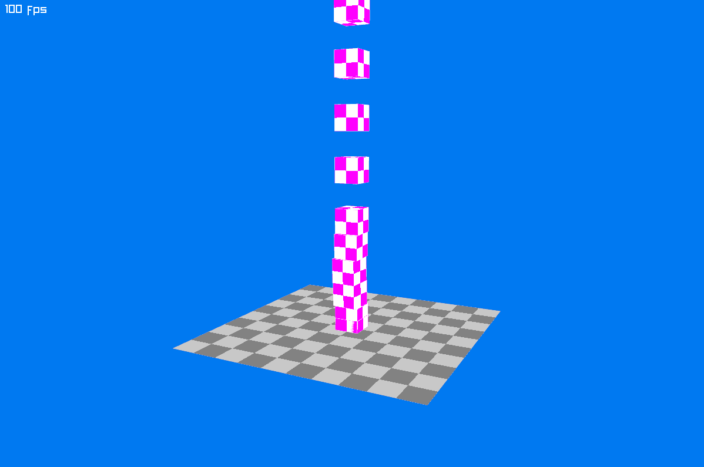

# Hello World

We will now add physics to the scene. We do this by creating a new instance of the World class and adding several rigid bodies to it.

Replace the content of `Program.cs` with the following code (marked lines indicate the additions to the source code):

```cs Program.cs {3-6,9-18,28,41-62,87-93} showLineNumbers
using System.Numerics;
using Raylib_cs;
using Jitter2;
using Jitter2.Collision.Shapes;
using Jitter2.Dynamics;
using Jitter2.LinearMath;
using static Raylib_cs.Raylib;

static Matrix4x4 GetRayLibTransformMatrix(RigidBody body)
{
    JMatrix ori = body.Orientation;
    JVector pos = body.Position;

    return new Matrix4x4(ori.M11, ori.M12, ori.M13, pos.X,
                         ori.M21, ori.M22, ori.M23, pos.Y,
                         ori.M31, ori.M32, ori.M33, pos.Z,
                         0, 0, 0, 1.0f);
}

static Texture2D GenCheckedTexture(int size, int checks, Color colorA, Color colorB)
{
    Image imageMag = GenImageChecked(size, size, checks, checks, colorA, colorB);
    Texture2D textureMag = LoadTextureFromImage(imageMag);
    UnloadImage(imageMag);
    return textureMag;
}

const int NumberOfBoxes = 12;

// set a hint for anti-aliasing
SetConfigFlags(ConfigFlags.FLAG_MSAA_4X_HINT);

// initialize a 1200x800 px window with a title
InitWindow(1200, 800, "BoxDrop example");

// dynamically create a plane model
Texture2D texture = GenCheckedTexture(10, 1,  Color.LIGHTGRAY, Color.GRAY);
Model planeModel = LoadModelFromMesh(GenMeshPlane(10, 10, 10, 10));
SetMaterialTexture(ref planeModel, 0, MaterialMapIndex.MATERIAL_MAP_DIFFUSE, ref texture);

// dynamically create a box model
texture = GenCheckedTexture(2, 1,  Color.WHITE, Color.MAGENTA);
Mesh boxMesh = GenMeshCube(1, 1, 1);
Material boxMat = LoadMaterialDefault();
SetMaterialTexture(ref boxMat, MaterialMapIndex.MATERIAL_MAP_DIFFUSE, texture);

// initialize the Jitter physics world
World world = new ();

// add a body representing the plane
RigidBody planeBody = world.CreateRigidBody();
planeBody.AddShape(new BoxShape(10));
planeBody.Position = new JVector(0, -5, 0);
planeBody.IsStatic = true;

// add NumberOfBoxes cubes
for(int i = 0; i < NumberOfBoxes; i++)
{
    RigidBody body = world.CreateRigidBody();
    body.AddShape(new BoxShape(1));
    body.Position = new JVector(0, i * 2 + 0.5f, 0);
}

// create a camera
Camera3D camera = new ()
{
    Position = new Vector3(-20.0f, 8.0f, 10.0f),
    Target = new Vector3(0.0f, 4.0f, 0.0f),
    Up = new Vector3(0.0f, 1.0f, 0.0f),
    FovY = 45.0f,
    Projection = CameraProjection.CAMERA_PERSPECTIVE
};

// 100 fps target
SetTargetFPS(100);

// simple render loop
while (!WindowShouldClose())
{
    BeginDrawing();
    ClearBackground(Color.BLUE);

    BeginMode3D(camera);

    DrawModel(planeModel, Vector3.Zero, 1.0f, Color.WHITE);

    world.Step(1.0f / 100.0f, true);

    foreach(var body in world.RigidBodies)
    {
        if(body == planeBody) continue; // do not draw this
        DrawMesh(boxMesh, boxMat, GetRayLibTransformMatrix(body));
    }

    EndMode3D();
    DrawText($"{GetFPS()} fps", 10, 10, 20, Color.WHITE); 

    EndDrawing();
}

CloseWindow();
```

Running your program, you should now see a few boxes dynamically falling onto the ground.

