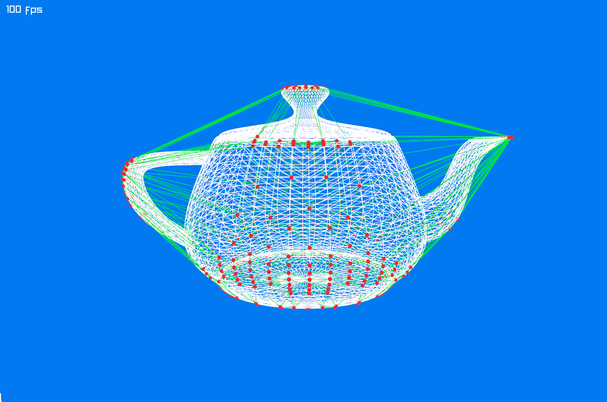

# Hull Sampling

The teapot is a concave shape, which we will approximate using its convex hull ([Wikipedia](https://en.wikipedia.org/wiki/Convex_hull)). As a first step, we will reduce the number of vertices used to construct the convex hull.

:::info Sampling
We could work with the entire set of vertices, but this comes with two main disadvantages:

1. The set may include vertices that lie inside the hull. While these do not affect the simulation outcome, they are still briefly considered during collision detection in each frame.

2. We typically don’t need an exact convex hull. Omitting a few vertices often has little effect on accuracy while significantly improving performance.

Reducing the number of vertices can help speed up the simulation without sacrificing collision fidelity.
:::

Jitter provides a built-in method to simplify the vertex set: `ShapeHelper.SampleHull`.
This function samples directions uniformly across the unit sphere and returns the vertices that are furthest away in those directions. These vertices, by definition, lie on the convex hull of the original shape.

Replace the content of `Program.cs` with the following code:

```cs Program.cs {24,58-61} showLineNumbers
using System.Numerics;
using Jitter2.Collision.Shapes;
using Jitter2.LinearMath;
using Raylib_cs;
using static Raylib_cs.Raylib;

// set a hint for anti-aliasing
SetConfigFlags(ConfigFlags.Msaa4xHint);

// initialize a 1200x800 px window with a title
InitWindow(1200, 800, "TeaDrop example");

// load the teapot model from a file
Model teapotModel = LoadModel("teapot.obj");

// Load the mesh vertices
if (teapotModel.MeshCount == 0)
    throw new Exception("Model could not be loaded!");

Mesh mesh;
unsafe { mesh = teapotModel.Meshes[0]; }

var allVertices = mesh.VerticesAs<JVector>().ToArray();
var vertices = ShapeHelper.SampleHull(allVertices.ToArray(), 4);

// just for visualization -
// we will not need to construct the explicit hull for the simulation!
var debugHull = ShapeHelper.MakeHull(vertices, 4);

// create a camera
Camera3D camera = new ()
{
    Position = new Vector3(-5.0f, 2.0f, 3.0f),
    Target = new Vector3(0.0f, 1.0f, 0.0f),
    Up = new Vector3(0.0f, 1.0f, 0.0f),
    FovY = 45.0f,
    Projection = CameraProjection.Perspective
};

// 100 fps target
SetTargetFPS(100);

// simple render loop
while (!WindowShouldClose())
{
    BeginDrawing();
    ClearBackground(Color.Blue);

    // make the scene rotate
    UpdateCamera(ref camera, CameraMode.Orbital);

    BeginMode3D(camera);

    // draw the teapot model
    DrawModelWires(teapotModel, Vector3.Zero, 1.0f, Color.White);

    // draw the sample vertices of the convex hull
    foreach (var vertex in vertices)
    {
        DrawSphere(vertex, 0.02f, Color.Red);
    }

    // for debugging: draw the explicit hull
    foreach (var vertex in debugHull)
    {
        DrawLine3D(vertex.V0, vertex.V1, Color.Green);
        DrawLine3D(vertex.V1, vertex.V2, Color.Green);
        DrawLine3D(vertex.V2, vertex.V0, Color.Green);
    }

    EndMode3D();
    DrawText($"{GetFPS()} fps", 10, 10, 20, Color.White);

    EndDrawing();
}

CloseWindow();
```



The teapot's wireframe is drawn in white, the green wireframe shows the convex hull, and the sampled hull vertices are depicted as red dots.
