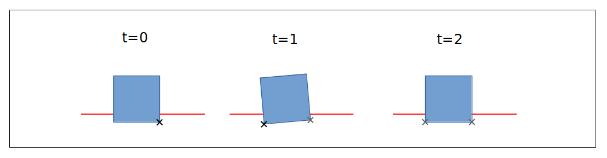

# Contact Generation

Jitter exclusively uses algorithms based on the Minkowski sum to detect collisions (available in the `NarrowPhase` class), i.e., there is no explicit code for the collision of two boxes, for example.

The collision of two boxes can serve as an illustrative example: The intersection of two boxes can be empty, a single point, a segment, a two-dimensional surface, or a three-dimensional volume. Handling all these cases in an algorithm is already complicated. The various kinds of results then must be managed by the solver. For instance, the solver must be able to resolve a collision where the intersection of two boxes is a two-dimensional surface, as is generally the case when one box is resting on another.

Jitter, like most other engines, handles all cases using contact points. The collision algorithms utilized by Jitter always report the point of deepest penetration as a contact point. The normal is the relative direction both shapes must move in to resolve the collision. Contact points might be cached, as depicted in the following figure where a smaller box rests on top of a larger static one (shown here for two dimensions):



In each frame (world.Step), only one collision point is generated for a pair of shapes (depicted as a black 'x'). This collision point is forwarded to the solver, which then attempts to resolve the collision. In the next frame, another point might be reported by the collision system. The previous point remains valid. Now both points are solved simultaneously in the solver - the box stabilizes and eventually rests on top of the larger static box. This stabilization over several frames can lead to significant jitter, which might worsen in the general three-dimensional case and also becomes more noticeable with larger time steps. For each collision pair, Jitter stores up to four contacts, which then more or less accurately describe the true contact surface (contact manifold).

## Auxiliary Contacts

Jitter employs a technique termed "auxiliary contacts", where additional contacts are generated for the general case where two flat surfaces are in contact. These additional contacts are calculated within one frame, generating the full contact manifold in "one shot", thereby preventing the jittering problem discussed in the last section. The `world.EnableAuxiliaryContactPoints` property can be used to enable or disable the usage of auxiliary contact point generation.

## Speculative Contacts

Speculative contacts can be utilized to prevent fast and small objects from tunneling through thin objects. An object moving quickly enough might "miss" a collision since the distance traveled between two frames exceeds the thickness of another object. Speculative contacts can be enabled on a per-body basis using `body.EnableSpeculativeContacts`. The `world.SpeculativeRelaxationFactor` and `world.SpeculativeVelocityThreshold` can be adjusted to fine-tune speculative contacts for your use case. However, note that an accurate simulation of fast-moving objects is only possible using smaller time steps. Speculative contacts might entail the cost of inaccurate collision detection and/or response.

## Collision Filters

Detected collisions can be filtered out or manipulated before they are used for contact manifold generation. 

The `world.BroadPhaseFilter` and `world.NarrowPhaseFilter` properties can be utilized to specify custom implementations for the filter interfaces.

### Example: Broadphase Filter

In this example, we have two "teams", team blue and team red. We will implement a filter that disregards all collisions between team members (rigid bodies) of different colors:

```cs
public class TeamFilter : IBroadPhaseFilter
{
    public class TeamMember { }
    
    public static TeamMember TeamRed = new();
    public static TeamMember TeamBlue = new();
    
    public bool Filter(Shape shapeA, Shape shapeB)
    {
        if (shapeA.RigidBody.Tag is not TeamMember || shapeB.RigidBody.Tag is not TeamMember)
        {
            // Handle collision normally if at least one body is not a member of any team
            return true;
        }

        // There is no collision between team red and team blue.
        return shapeA.RigidBody.Tag == shapeB.RigidBody.Tag;
    }
}
```

The `TeamFilter` class can then be instantiated and assigned to `world.BroadPhaseFilter`. Rigid bodies of different colors do not interact:

```cs
world.BroadPhaseFilter = new TeamFilter();
...
bodyA.Tag = TeamFilter.TeamBlue;
bodyB.Tag = TeamFilter.TeamRed;
bodyC.Tag = TeamFilter.TeamRed;
```

### Narrowphase Filter

The narrow phase filter operates similarly. However, the callback is called after narrow-phase collision detection, meaning detailed collision information (normal, penetration depth, collision points) is available at this stage.

The default narrow phase collision filter in Jitter is assigned to an instance of `TriangleEdgeCollisionFilter`, which filters out so-called "internal edges". Consider the following example of a box sliding on static triangles (referred to as "ground", depicted here in 2D as blue and red segments):


The box slightly sinks into the ground due to the possibility of the collision from gravity not being perfectly resolved by design (the solver permits a small penetration).

For $t=1$, the collision system detects a collision with the red triangle. While this is accurate, the collision normal might point in the opposite direction of the box's movement, since this is the direction in which the box and triangle must move to resolve the collision (rather than "lifting" the box up). Consequently, the box stumbles over the internal edge, instead of sliding over the non-existing gap between the two triangles.
